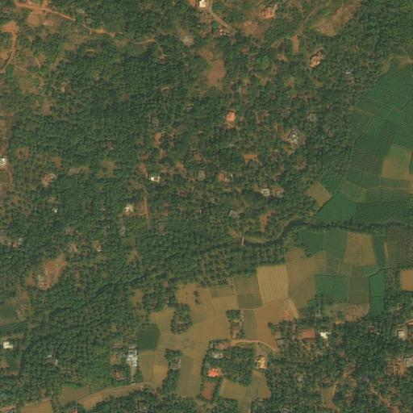
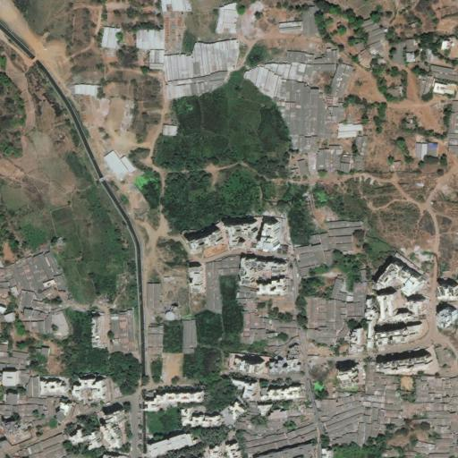

# DLCV HW1: Image Classification and Semantic Segmentation

## Pronlem 1: Image Classification

A pytorch implementation of Vgg16 using pretrained model.

### Usage

* Training

  ```
  python train_p1.py <--epochs 20> <--batch_size 32> <--lr 0.001>
  ```
* Testing

  ```
  python3 test_p1.py <--p1_input_dir ./p1_data/val_50> <--p1_output_file output.csv> <--ckpt your_ckpt.pt>
  ```

### Model Performance


| Model    | Accuracy |
| ---------- | ---------- |
| Vgg16    | 0.7268   |
| Resnet50 | 0.8620   |

## Problem 2: Semantic Segmentation

* Training

  ```
  python train_p2.py <--epochs 20> <--batch_size 16> <--lr 0.0005>
  ```
* Testing

  ```
  python3 test_p2.py <--p2_input_dir ./p2_data/> <--p2_output_file ./predict> <--ckpt your_ckpt.pt>
  ```

### Model Performance


| Model       | Mean IoU |
| ------------- | ---------- |
| Vgg16FCN32s | 0.676    |
| Vgg16FCN8s  | 0.696    |

### Prediction Visualization


| Validation image | 0010                                                          | 0097                                                          | 0107                                                          |
| ------------------ | --------------------------------------------------------------- | --------------------------------------------------------------- | --------------------------------------------------------------- |
| Satellite        |  |   |   |
| Epoch 1          |                                                               |                                                               |                                                               |
| Epoch 10         |                                                               |                                                               |                                                               |
| Epoch 20         |                                                               |                                                               |                                                               |
| Epoch 27         |                                                               |                                                               |                                                               |
| Ground Truth     |                                                               |                                                               |                                                               |
